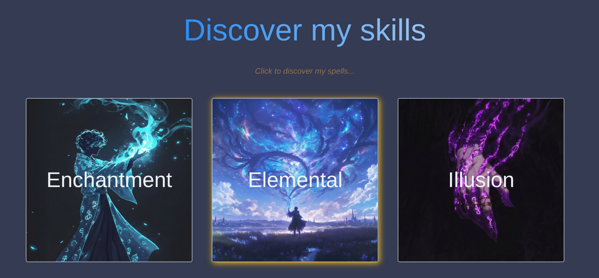
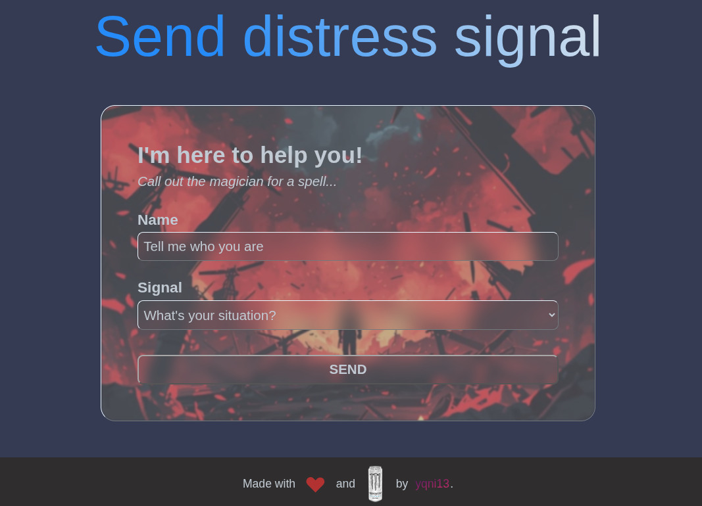

# yqni13 | $\texttt{\color{royalblue}{MagicPortfolio}}$
### $\textsf{\color{brown}{v1.0.0}}$

#### Coursera certificate basic web development project (simple portfolio using basic HTML/CSS/JavaScript). 

### visit <a href="https://yqni13.github.io/WebDevCertProject/">HERE</a> live

 

## 📑 $\textsf{\color{salmon}Exercise Information}$

As I had already built my own portfolio using Angular and NodeJS, I created a fake portfolio that sends you on a tiny fantasy adventure, reviewing this "Magic Portfolio".

The grading criteria are integrated as follows:
| Criteria | Implementation |
|----------|----------------|
| HTML struct | index.html uses < section > elements as target to load respective components |
| Accessibility | alt tags (nav, footer, p ...), aria-attributes + keyboard navigation integrated |
| Styling | combination of comp-based, special and base stylesheets => styling across website |
| Interactivity | skills open full-size modal and contact form has different output scenarios |
| Responsive Design | supports multiple screen sizes (media queries, flexbox, em, vw, vh ...) |

 

## 🧩 $\textsf{\color{salmon}Features}$

### $\textsf{\color{teal}Skill List}$

On this little adventure, the magician invites you to discover all the skills he has learnt over his many years (and offers you some interactivity). These skills are nested in multiple categories. Open them to see the difficulty, name and description of each spell and have fun with the creative part of my project. 😊 
Each modal opens via an onclick/onkeydown event but is highlighted differently (gold on mouse hover and white on keyboard navigation).

    
    Figure 1 - Interactivity_SkillList, v1.0.0

 

### $\textsf{\color{teal}Distress Signal}$

Want to see some action at the end? 
I prepared some animations for you to have fun with and to feel a little closer to this fantasy story: 
Type in your name, choose a signal and see what happens once you hit "SEND"!

    
    Figure 2 - Interactivity_DistressSignal, v1.0.0

 

### $\textsf{\color{teal}File Structure Overview}$

[frontend/src/index.html](frontend/src/index.html) - load main html elements, stylesheet and script 
[frontend/src/style.css](frontend/src/styles.css) - load all other stylesheets and define stylings that affect the whole website 
[frontend/src/script.js](frontend/src/script.js) - load all other html files and init respective script files 
[frontend/src/stylesheets/media.css](frontend/src/stylesheets/media.css) - responsive design 
[frontend/src/app/components/common](frontend/src/app/components/common) - common components (nav, footer, animations, modal)
[frontend/src/app/components/pages](frontend/src/app/components/pages) - page components (home, about, skills, experience, contact)
[frontend/src/assets](frontend/src/assets) - resources (images, doc_icons)

 

## 🧑🏼‍🎨 $\textsf{\color{salmon}Artists}$

The selected (and edited) images come from multiple artists who share their work on Pinterest. 
Here are the links to the artists: 
| Artist | Images |
|--------|--------|
|[mwr.design](https://at.pinterest.com/droppthetea_aiart/)|[image](https://at.pinterest.com/pin/1104930089880985972/)|
|[SoulMedium](https://at.pinterest.com/SoulMedium1/)|[image](https://at.pinterest.com/pin/1104930089880985803/)|
|[Erlison Souza](https://at.pinterest.com/erlisonsouzasantos91/)|[image](https://at.pinterest.com/pin/879750108479687803/)|
|[LM](https://co.pinterest.com/LM_PLMP/)|[image](https://co.pinterest.com/pin/739012620151942090/)|
|[HalfOf333](https://at.pinterest.com/HalfOf333/)|[image](https://at.pinterest.com/pin/682647256070403890/)|
| unknown | [image](https://at.pinterest.com/pin/1104930089880985773/)|

 

## 🔧 $\textsf{\color{salmon}Testing}$

### $\textsf{\color{teal}Cross-browser testing}$

 |  |  |  | 
|:------:|:-------:|:------:|:-----:|:------:|
| Brave  | Firefox | Chrome | Opera | Edge   |
| Yes    | Yes*    | Yes    | Yes   | Yes    |

 

*This browser does not support some of the styles used on this web application.

 